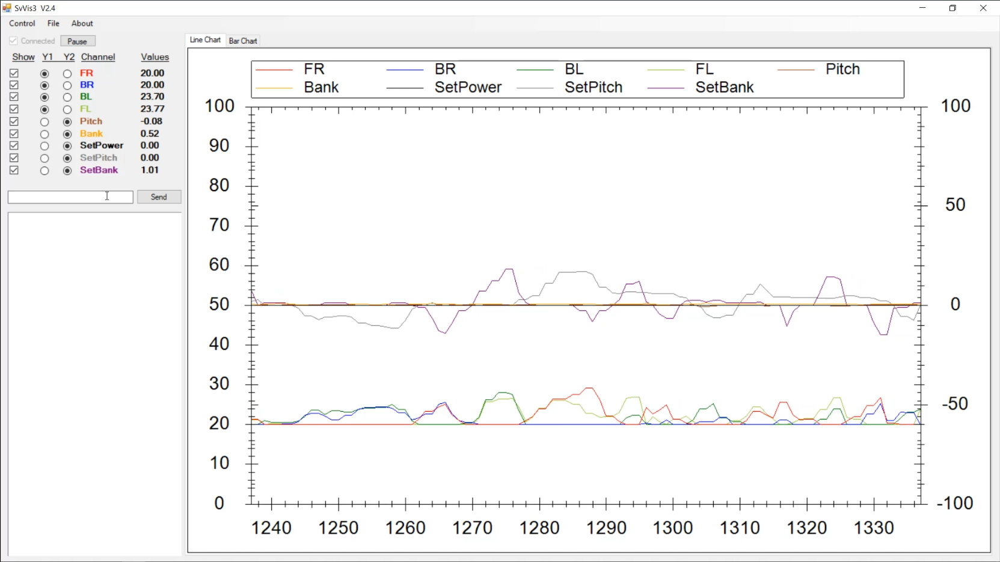

# SvVis

Visualisierungsprogramm, weilches Daten von der seriellen Schnittstelle einliest und anzeigt.

Weiterentwicklung: Diplomarbeit "GLADOS" von Killian Smith

Basis: Diplomarbeit "Autonomous Robots" von Alex Leidwein

